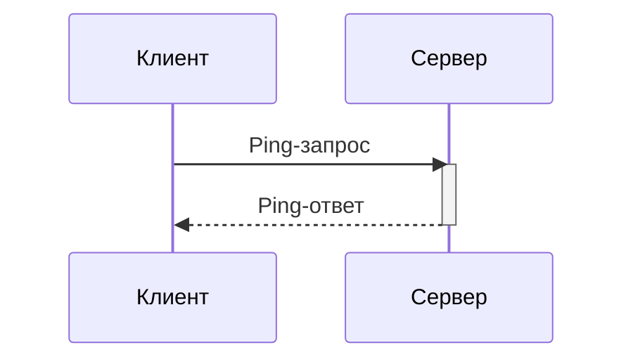
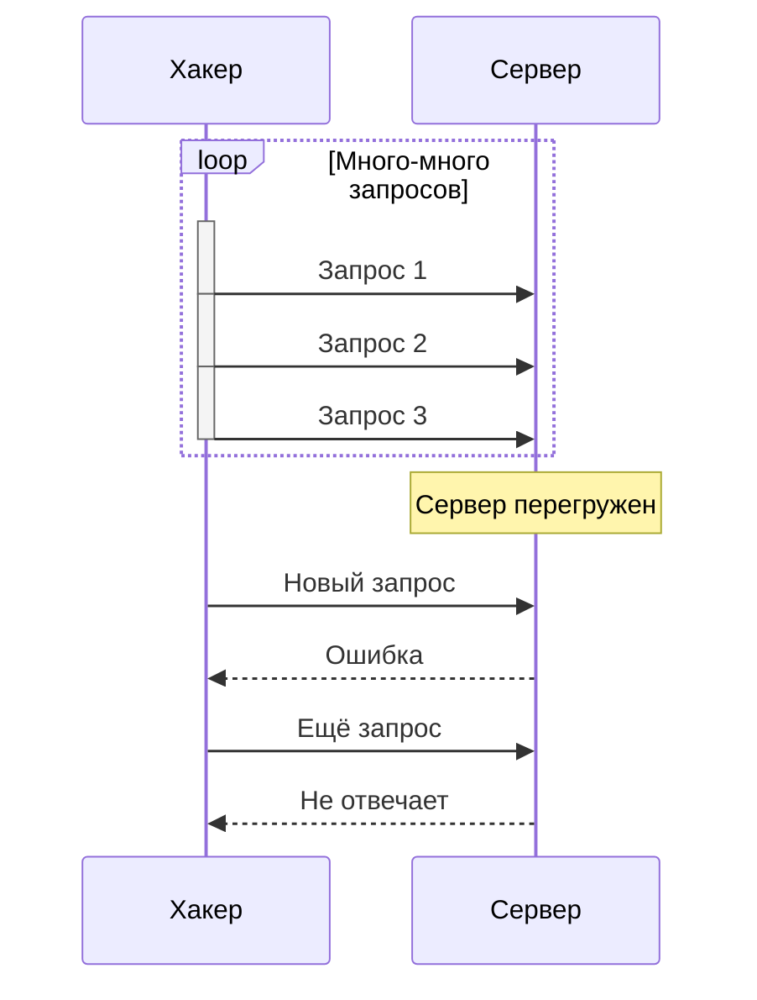

## Составление блок-схем с помощью mermaid - sequence-диаграммы

**Цель работы:** Научиться создавать sequence-диаграммы с помощью mermaid

**Задачи работы:**
1. Изучить теоретический материал
2. Составить sequence диаграммы по заданию

**Критерии оценки:**
1. Правильность составленных диаграмм
2. Полнота составленных диаграмм
3. Выполнение дополнительного задания

### Теоретическая часть
[[Основы работы с mermaid - sequence-диаграммы]]

### Практическое часть

#### Задание 1.

Напишите Sequence-диаграмму отправки ping-запроса на сервер.

**Условия**: В диаграмме должно быть:
- Запрос и ответ от сервера




#### Задание 2.

В теоретической части рассматривался пример авторизации на сайте. Напишите подобную sequence-диаграмму авторизации на сайте, но с двойной аутентификацией.

**Условия**: В диаграмме должно быть:
- Ввод пароля
- Двойная аутентификация (например по смс)

```mermaid
sequenceDiagram

    participant Пользователь

    participant Веб-сайт

    participant СерверАутентификации

    participant СМС-Сервис

  

    Пользователь->>Веб-сайт: Ввод логина и пароля

    activate Веб-сайт

    Веб-сайт->>СерверАутентификации: Проверка логина/пароля

    activate СерверАутентификации

    СерверАутентификации-->>Веб-сайт: Пароль верный

    deactivate СерверАутентификации

    Веб-сайт->>СМС-Сервис: Запрос на отправку кода

    activate СМС-Сервис

    СМС-Сервис-->>Пользователь: SMS с кодом подтверждения

    СМС-Сервис-->>Веб-сайт: Код отправлен

    deactivate СМС-Сервис

    Веб-сайт-->>Пользователь: Запрос ввода SMS-кода

    deactivate Веб-сайт

    Пользователь->>Веб-сайт: Ввод SMS-кода

    activate Веб-сайт

    Веб-сайт->>СерверАутентификации: Проверка SMS-кода

    activate СерверАутентификации

    СерверАутентификации-->>Веб-сайт: Код верный

    deactivate СерверАутентификации

    Веб-сайт-->>Пользователь: Успешная авторизация

    deactivate Веб-сайт
   ```

#### Задание 3.

Представьте что вы кассир в Пятерочке. К вам приходит покупатель с покупками. Визуализируйте вашу работу с покупателем и кассой.

**Условия**: 
- Должно быть как минимум 4 объекта

```mermaid
sequenceDiagram
   participant Покупатель
   participant Кассир
   participant Касса
   participant Товар

   activate Кассир
   Кассир->>Покупатель: Приветствие
   deactivate Кассир
   
   loop Сканирование товаров
   activate Кассир
   Кассир->>Товар: Взять товар
   deactivate Кассир
   
 activate Кассир
   Кассир->>Касса: Сканировать штрихкод
  deactivate Кассир

   activate Касса
   Касса-->>Кассир: Данные товара (название, цена)
 deactivate Касса
 
  activate Кассир
   Кассир->>Покупатель: Озвучить товар и цену
   deactivate Кассир
   end
   
   activate Кассир
   Кассир->>Покупатель: "Карту лояльности?"
   deactivate Кассир
   
   activate Покупатель
   Покупатель-->>Кассир: Номер телефона/карта
   deactivate Покупатель
   
   activate Кассир
   Кассир->>Касса: Ввести данные лояльности
   deactivate Кассир
   
   activate Касса
   Касса-->>Кассир: Итоговая сумма
   deactivate Касса
   
   activate Кассир
   Кассир->>Покупатель: Озвучить сумму к оплате
   deactivate Кассир
   
   activate Покупатель
   Покупатель-->>Кассир: Оплата (наличные/карта)
   deactivate Покупатель
   
   activate Кассир
   Кассир->>Касса: Обработать оплату
   deactivate Кассир
   
   activate Касса
   Касса-->>Кассир: Подтверждение оплаты + чек
   deactivate Касса
   
   activate Кассир
   Кассир->>Покупатель: Передать чек и сдачу
   Кассир->>Покупатель: Прощание
  deactivate Кассир
```

#### Задание 4*.

Представьте что вы осуществляете DDoS атаку на Сервер. Визуализируйте это в диаграмме.

**Условия**:
- Хакер осуществляет атаку асинхронно.
- Нужно показать как сервер перестаёт отвечать на вопросы



